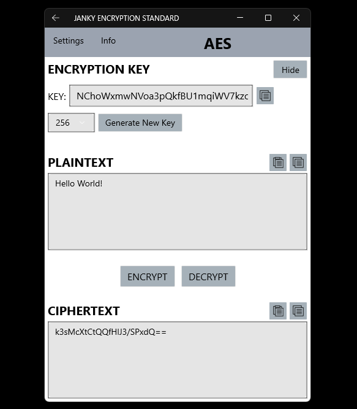

# Janky Encryption Standard (JES)

The intent of JES is to provide some familiarity with methods of encryption.

A simple GUI provides the functionality of the encryption schemes that have been experimented with.

---

# Application Features

  

## Current
- Intuitive GUI for encryption and decryption with easy text copy.
- Multiple themes: light, dark, and night modes.
- Short explanation of how each cryptographic scheme works.
- Play Morse code tones with adjustable pitch and speed.
- AES and RSA key generation (keys for all encryption methods are visible for inspection and direct use).
- User-selectable AES encryption levels.
- Terrible implementations of the following:
	- Ceasar Cipher
	- Rivest-Shamir-Adleman (RSA)         (needs some work)
	- Advanced Encryption Standard (AES)
	- Morse Code
 
## Planned
- Fixing UI:
	- Icons
	- Themes
- Depending on how ambitious I feel, I may attempt the following:
	- Elliptic-curve Cryptography (ECC)
	- Digital signature
	- A post-quantum cryptographic scheme (Kyber, Dilithium, or Falcon)
	- Audio encryption
	- Steganography

---

# Development Status

Unit tests have been created for Ceasar Cipher. Testing for the other cryptographic schemes will be added.

## Known Issues
- RSA can't find large primes fast enough, so only several characters may be encrypted at a time. Need to implement Miller-Rabin.
- App is unstable and crashes on occasion (Ceasar Cipher seems to be the issue).
- Themes are poorly implemented (lack contrast, sometimes incorrect colors).

---

## Project Info
**Status:** Alpha (early development, unstable)  
**Author:** T. Stratton  
**Start Date:** 23-MAR-2024  
**License:** MIT License – see [LICENSE](./LICENSE)  
**Language & Build Tools:** C# 12.0+, .NET 9 SDK, .NET 8.0 target framework  
**Topics:** cryptography, encryption